# 恶意代码分析实战二：静态分析基础技术

我们主要通过以下的四个实验，来学习静态分析的基础技术，请大家务必完成每个实验中题目，这样才能得到有效的水平提升。

实验中的工具或样本都可以在这里下载到：https://github.com/Vxer-Lee/MalwareAnalysis


## 实验一：

```
----------------
Lab01-01.exe
Lab01-01.dll
----------------
使用工具：
1. StudyPE+ x86
2. Strings
3. VirSCAN.org
-=-=-=-=-=-=-=-=-=-=-=-=-=-=-=-=-=-=-=-=-=-=-=-=-=-=-=-=-=-=-=-=-=-=-=-=-=-=-=-=-=-=
实验内容：
1、将文件上传到http://www.VirusTotal.com 进行分析并查看报告。文件匹配到了已有的反病毒软件特征吗？
2、这些文件是什么时候编译的？
3、这两个文件中是否存在迹象说明他们是否被加壳或混淆了？如果是，这些迹象在哪里？
4、是否有导入函数显示出了这个恶意代码是做什么的？如果是，是哪些导入函数？
5、是否有任何其他文件或基于主机的迹象，让你可以在受感染系统上查找？
6、是否有基于网络的迹象，可以用来发现受感染机器上的这个恶意代码？
7、你猜这些文件的目的是干什么的？
-=-=-=-=-=-=-=-=-=-=-=-=-=-=-=-=-=-=-=-=-=-=-=-=-=-=-=-=-=-=-=-=-=-=-=-=-=-=-=-=-=-=
```

实验一主要的目的是让我们通过实践，学习到PE结构分析工具的使用，还有字符串分析工具和在线病毒查杀网站的使用

### VirSCAN.org

实验中的题目1是想让我们将文件上传到VirusTotal.com进行查毒，但是这个网站是国外的并且需要翻墙才能访问，所以我们可以用国内的 [VirSCAN.org](https://www.virscan.org/)来代替。

上传exe后，网站提示文件已经上传过了，那我们直接点查看最后一次的扫描结果即可。

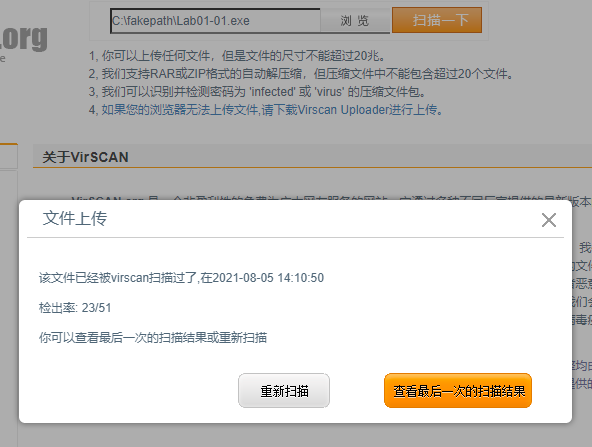 

这里可以看到许多杀毒软件报毒了，所以我们可以判定这个文件是属于恶意软件了。

而像有的杀毒软件却没有报毒，出现这种情况应该是该杀毒软件厂商未能收集到样本的特征码并且加入到他的病毒库中，所以他就无法检测到我们的恶意软件。（dll也是通过同样的方式上传即可，这里不在重复演示）

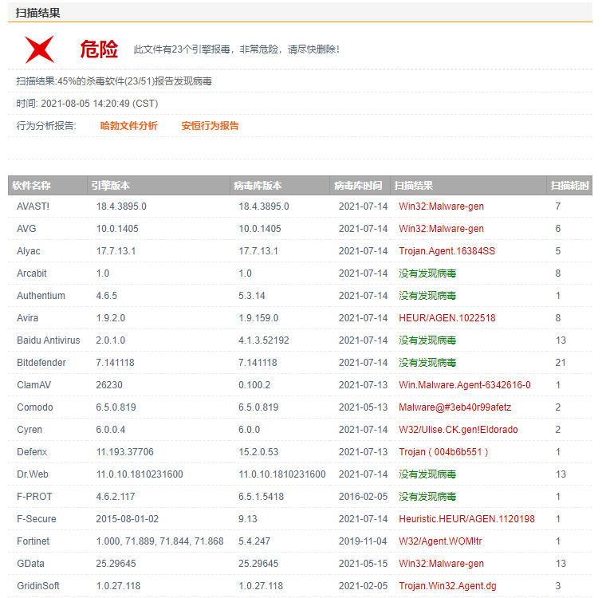 

### 查看文件编译时间：

PE文件的编译时间呢，存在PE文件头当中，我们平时做逆向或者恶意代码分析，最好要一张PE结构图来进行查阅。

（仔细看荧光笔的部分，在一个`_IMAGE_FILE_HEADER`结构体里面就有存放文件编译时间戳的变量`TimeDateStamp`）

 

我们可以通过像`StudyPE+ x86`这类PE结构分析软件来查看文件的编译时间，如下图我们通过查看PE头中的文件时间戳，并且计算出时间即可得到文件的编译时间。

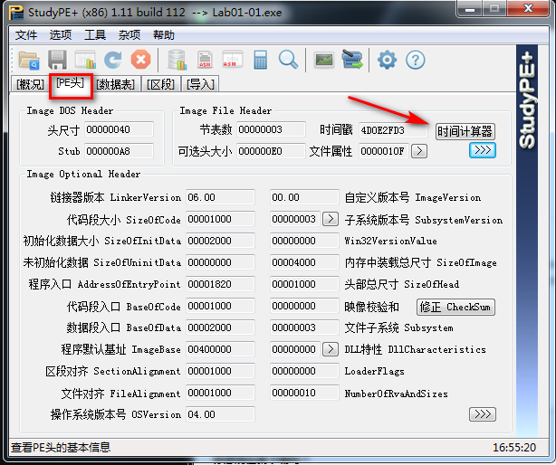 

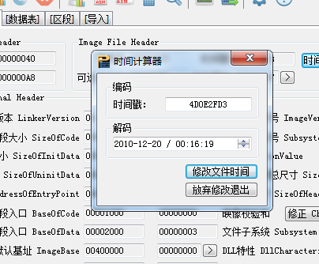 

### StudyPE+ x86 查壳

StudyPE中在文件类型这地方会显示壳的特征，而需要注意的是如果程序`没有加壳`，那么他会直接显示出`开发的语言`，当然还有第三种情况就是会显示`Unknow Exe Type`，意思是他无法识别是什么壳或者什么语言开发的。

我们可以看到这里他是显示了`E Language -> WuTao`，什么意思呢？他这里其实是想告诉我们Lab01-01.exe是用易语言进行开发的，其实呢并不是，易语言他底层其实就是调用VC6++进行编译的，所以这个程序他是用VC6++开发的。

```
易语言
  |  (底层)
  v
 VC6++
```

 

### 导入函数

Lab01-01.exe中引用了两个动态库，而需要注意的是以下4个API函数。

```c++
CreateFileA //创建文件或打开文件
FindNextFileA //这两个都是用来遍历指定目录所有文件的，特别需要注意因为像勒索软件就需要遍历全盘 对文件进行加密
FindFirstFileA
CopyFileA //拷贝文件，恶意软件往往喜欢将自己拷贝到系统目录。
```

 

在Lab01-01.dll中需要注意的是这三个地方。

其中`KERNEL32.dll`中的两个API函数

```C++
;这两个都是互斥量函数，恶意程序往往喜欢创建或打开一个互斥量，因为创建了互斥量后再同一时间只允许一个程序访问其资源。

CreateMutex //创建互斥量
OpenMutex   //打开互斥量
```

而这个`WS2_32.dll`他是一个网络通讯的动态库，所以我们有理由相信这个恶意程序他会有网络通信的操作。

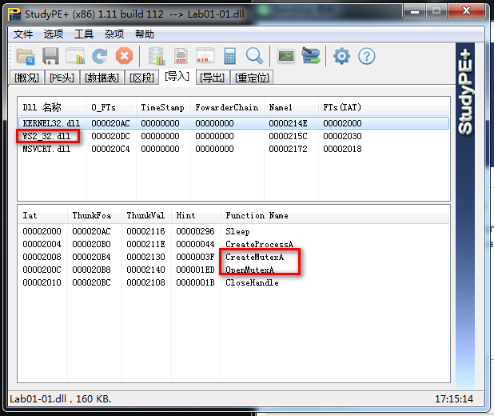 

### Strings查看敏感字符串信息

Strings是微软官方的一个命令行工具，主要用来查看程序中的所有字符串信息，平时我们通过敏感的字符串来定位分析一个程序是极好的选择。

```
命令行：
Strings.exe "Lab01-01.exe"

//值得注意的地方有两处
首先第一处他这里不是kernel32.dll而是kerne132.dll是1234的1，
然后第二处是Lab01-01.dll
//再结合我们上面分析的导入表，分析出他有个CopyFile的api函数，所以可以得出结论：
这个exe程序想把Lab01-01.dll文件拷贝到系统目录并且伪装成系统文件"kernel32.dll"
```

 

```
命令行：
Strings.exe "Lab01-01.dll"

发现有一个ip地址，"127.26.152.13" 并且结合之前dll的导入函数有网络通讯的动态库。
所以最后的结论是：Lab01-01.exe调用Lab01-01.dll对"127.26.152.13"进行连接，此ip可能是黑客用来控制的主控端ip，程序还会将Lab01-01.dll拷贝到系统目录伪装成"kernel32.dll"，以此达到一个持久化的目的。
```

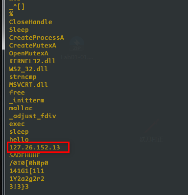 


## 实验二：

```
----------------
Lab01-02.exe
----------------
使用工具：
1. StudyPE+ x86
2. Strings
3. VirSCAN.org
4. Free UPX
-=-=-=-=-=-=-=-=-=-=-=-=-=-=-=-=-=-=-=-=-=-=-=-=-=-=-=-=-=-=-=-=-=-=-=-=-=-=-=-=-=-=
实验内容：
1、将文件上传到http://www.VirusTotal.com 进行分析并查看报告。文件匹配到了已有的反病毒软件特征吗？
2、是否有这个文件被加壳或混淆的任何迹象？如果是这样，这些迹象是什么？如果该文件被加壳，请进行脱壳。
3、有没有任何导入函数能够暗示出这个程序的功能？如果是，是哪些导入函数，他们会告诉你什么？
4、哪些基于主机或基于网络的迹象可以被用来确定这个恶意代码感染的机器？
-=-=-=-=-=-=-=-=-=-=-=-=-=-=-=-=-=-=-=-=-=-=-=-=-=-=-=-=-=-=-=-=-=-=-=-=-=-=-=-=-=-=
```

`实验二主要的学习目的是学会用UPX脱壳`，我这里就不再演示题目中的常规操作了，请大家务必都完成这些题目，因为动手实践和反复练习才能让你飞速的涨经验升级，(就像刷无聊的小怪)

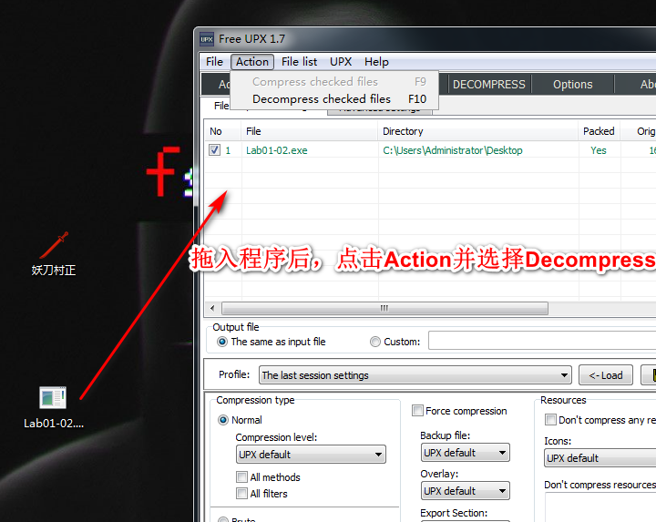 

脱壳前：

这里他显示了我们之前说过的`Unknow EXE Type`，也就是说他无法识别出程序的类型，这里解决的办法是点击深度搜索。

 

 

脱壳后：

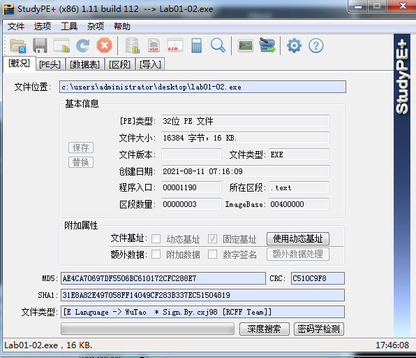 


## 实验三：

```
----------------
Lab01-03.exe
----------------
使用工具：
1. StudyPE+ x86
2. Strings
3. VirSCAN.org
4. linxerUnpack
-=-=-=-=-=-=-=-=-=-=-=-=-=-=-=-=-=-=-=-=-=-=-=-=-=-=-=-=-=-=-=-=-=-=-=-=-=-=-=-=-=-=
实验内容：
1、将文件上传到http://www.VirusTotal.com 进行分析并查看报告。文件匹配到了已有的反病毒软件特征吗？
2、是否有这个文件被加壳或混淆的任何迹象？如果是这样，这些迹象是什么？如果该文件被加壳，请进行脱壳。
3、有没有任何导入函数能够暗示出这个程序的功能？如果是，是哪些导入函数，他们会告诉你什么？
4、哪些基于主机或基于网络的迹象可以被用来确定这个恶意代码感染的机器？
-=-=-=-=-=-=-=-=-=-=-=-=-=-=-=-=-=-=-=-=-=-=-=-=-=-=-=-=-=-=-=-=-=-=-=-=-=-=-=-=-=-=
```

`实验三的主要学习目的是学会用linxerUnpack进行通用脱壳`，还是希望大家将题目都做完，这里就不演示了。

查壳：

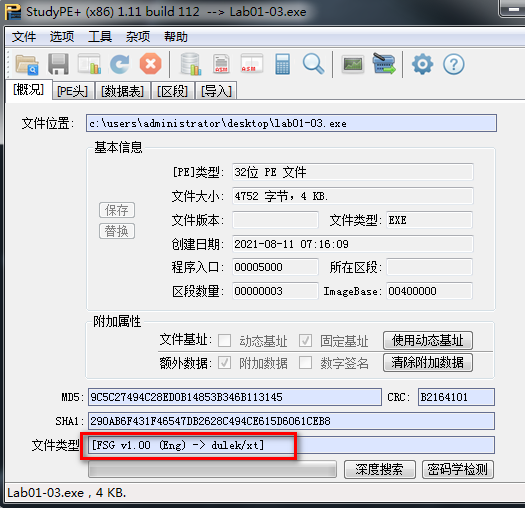 

脱壳：

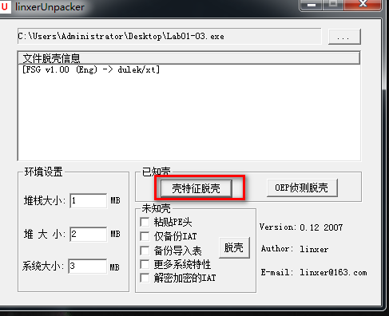 

 

## 实验四：

```
----------------
Lab01-04.exe
----------------
使用工具：
1. StudyPE+ x86
2. Strings
3. VirSCAN.org
4. Restorator
-=-=-=-=-=-=-=-=-=-=-=-=-=-=-=-=-=-=-=-=-=-=-=-=-=-=-=-=-=-=-=-=-=-=-=-=-=-=-=-=-=-=
实验内容：
1、将文件上传到http://www.VirusTotal.com 进行分析并查看报告。文件匹配到了已有的反病毒软件特征吗？
2、是否有这个文件被加壳或混淆的任何迹象？如果是这样，这些迹象是什么？如果该文件被加壳，请进行脱壳。
3、这个文件是什么时候被编译的？
4、有没有任何导入函数能够暗示出这个程序的功能？如果是，是哪些导入函数，他们会告诉你什么？
5、哪些基于主机或基于网络的迹象可以被用来确定这个恶意代码感染的机器？
6、这个文件在资源段中包含一个资源，使用Restorator工具来检查资源，然后抽取资源。从资源中你能发现什么吗？
-=-=-=-=-=-=-=-=-=-=-=-=-=-=-=-=-=-=-=-=-=-=-=-=-=-=-=-=-=-=-=-=-=-=-=-=-=-=-=-=-=-=
```

`实验四的主要学习目的是学会用资源管理器，查看资源`，还是希望大家手动将1-6到题目亲手做一遍。

在Lab01-04中有个"BIN"的资源，并且文件头是以`MZ`开头，可以确定他是一个PE文件，我们用右键功能将其导出。

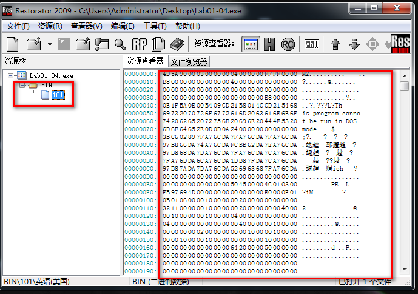 

 

导出后发现是一个EXE程序，并且没有加壳。

接着我们继续来看看他的导入表，发现他有两个比较可疑的api函数

 

 

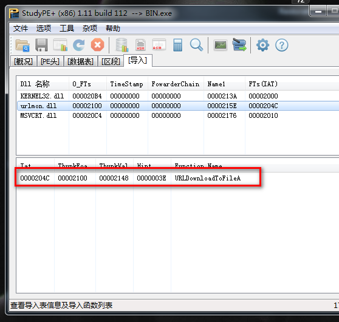 

```c++
WinExec //这个api主要是用来进行执行程序、命令操作。
URLDwonloadToFile //这个api是从网络上下载文件并保存到本地的一个操作。
    
所以请大家自行去完成他会下载一个什么程序 并且执行呢？
```


## 最后总结：

我们分别学习了以下软件或网站

- www.virscan.org (查杀恶意软件在线网站)

- StudyPE+ x86       (查壳、查看文件编译时间、查看导入表)
- Strings.exe            (分析程序中的字符串)
- Free UPX                (脱UPX壳)
- linxerUnpacker  (脱通用的壳)


