# 恶意代码分析实战三：动态分析基础技术

这节课主要是通过以下的例子，学会如何使用动态分析基础技术的一些工具。

- Process Monitor
- Process Explorer
- WireShark
- Regshot
- rundll32
- net start 命令


## 实验一：

```
----------------
Lab03-01.exe
----------------

使用工具：
1. Process Explorer
2. Strings
3. Process Monitor
4. StudyPE
5. WireShark

-=-=-=-=-=-=-=-=-=-=-=-=-=-=-=-=-=-=-=-=-=-=-=-=-=-=-=-=-=-=-=-=-=-=-=-=-=-=-=-=-=-=
实验内容：
1、找出这个恶意代码的导入函数与字符串列表？
2、这个恶意代码在主机上的感染特征是什么？
3、这个恶意代码是否存在一些有用的网络特征码？如果存在，他们是什么？
-=-=-=-=-=-=-=-=-=-=-=-=-=-=-=-=-=-=-=-=-=-=-=-=-=-=-=-=-=-=-=-=-=-=-=-=-=-=-=-=-=-=
```

### 题目1解答：

导入表里面只有一个API函数，`ExitProcess`退出进程相关的api函数。

所以这个程序有可能的功能是打开后就退出。

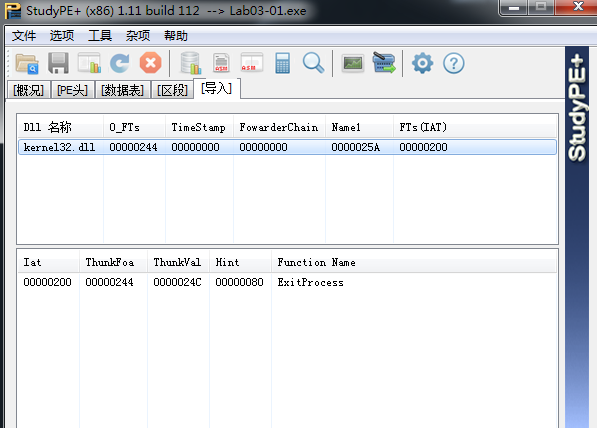 

查看字符串发现有几处可疑的地方：一个网址、三个注册表值，其中一个注册表值还是自启动的注册表键值。

说明恶意程序有可能会打开这个恶意网址，并且添加到自启动。

 

### 题目2解答：

题目2中问了`这个恶意代码在主机上的感染特征是什么？`，那么我们只靠静态分析是看不出来的，这时候就用到了动态分析的基础技术了。

#### Process Explorer

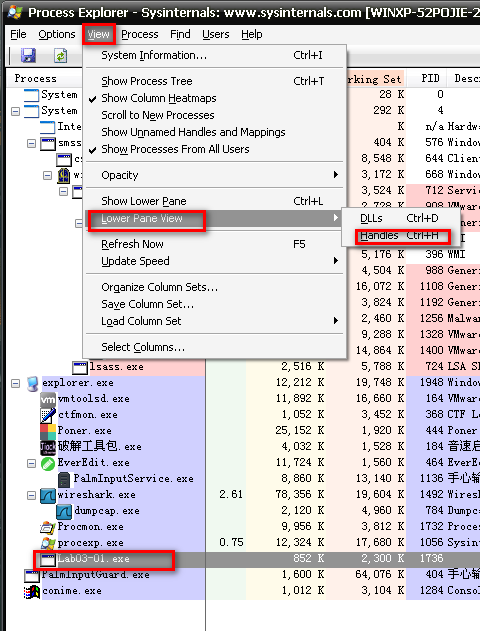 

需要注意的是这里创建了一个互斥量`WinVMX32`。

恶意程序经常会创建互斥量，也为这样的话他就可以对计算机中的某个资源在同一时刻只有一个对象对其进行访问。

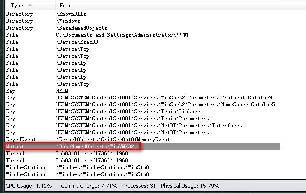 

接着再来看看DLL，操作方法和上面的Handles一样。

值得注意的是标红色标记那里，他调用了ws2_32.dll，说明这个程序他有网络通讯的功能。

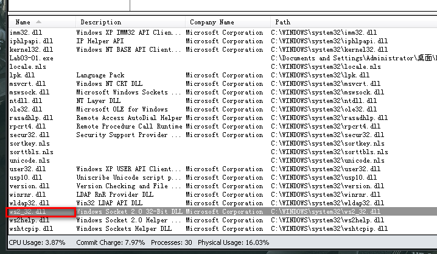 

#### Process Monitor

打开Process Monitor选择过滤器，过滤掉不必要的进程信息。

 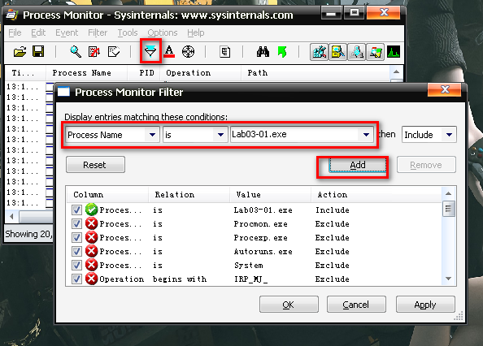 

可以看到`Process Monitor`帮我们监控到了很多信息，但是我们不需要这么多信息，我们只关心我们需要关注的操作。

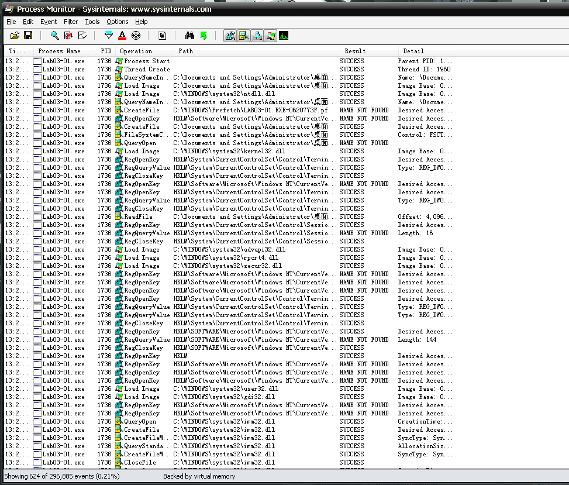 

对其就行行为`WriteFile`和`RegSetValue`进行过滤，分别的功能是写入文件和注册表操作。

过滤后看图2，发现监控到3处敏感地方：

1. 程序在`windows\system32`出写出了文件`vmx32to64.exe`
2. 程序添加了自启动注册表值`CurrenVersion\Run\VideoDriver`
3. 程序操作了随机数，注册表值`RNG\Seed`

用Process Monitor分析后可知该恶意程序会添加自启动，会写出文件到系统目录，会操作随机数。
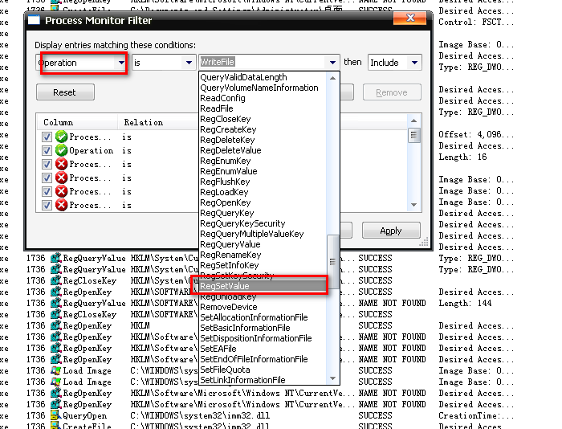 
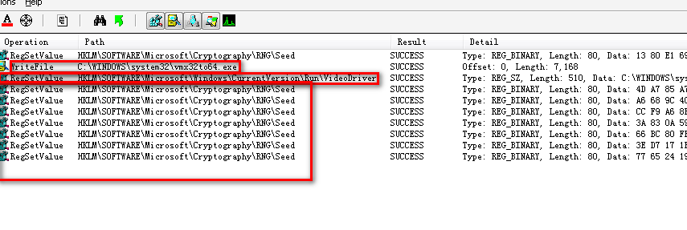 
#### WireShark
wireshark打开后，直接监听网卡流量即可。

WireShark监控中看到有DNS协议，恶意软件解析了域名`www.practicalmalwareanalysis.com`。

监控到SSL协议，发送了256字节的随机乱码数据。

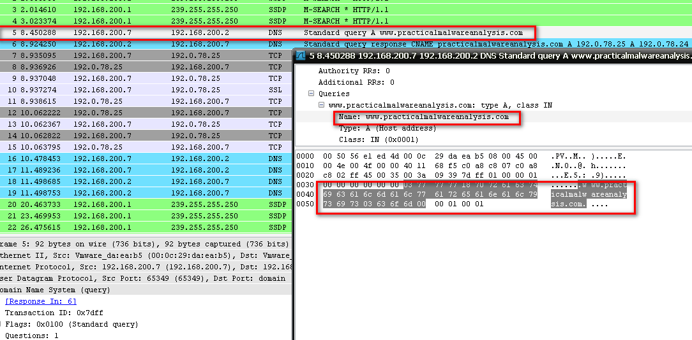 

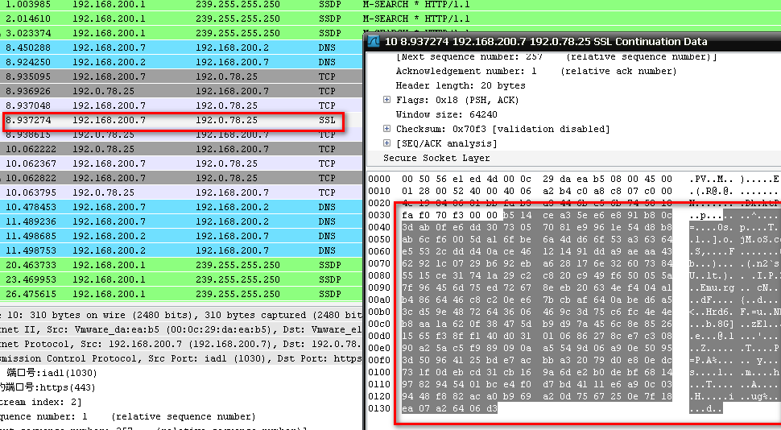 

### 实验一总结：

我们通过了使用Process Monitor和Process Explorer与WireShark等动态监控的软件对实验一进行了分析，并且得出如下结论：

```
Lab03-01.exe会创建互斥量，会将自身拷贝到系统\Windows\system32\vmx32to64.exe中，恶意程序会创建启动项，恶意程序还会有网络通讯功能，访问www.practicalmalwareanalysis.com并且发送随机的256字节乱码数据。
```


## 实验二：动态分析不可运行的DLL

`.dll，动态链接库英文为DLL，是Dynamic Link Library的缩写。`

由于DLL不能像EXE那样单独运行，他需要由EXE来装载动态调用，下面我们就来介绍如何对DLL进行动态分析。

```
----------------
Lab03-02.dll
----------------

使用工具：
1. Process Explorer
2. Strings
3. Process Monitor
4. StudyPE
5. WireShark
6. Regshot

-=-=-=-=-=-=-=-=-=-=-=-=-=-=-=-=-=-=-=-=-=-=-=-=-=-=-=-=-=-=-=-=-=-=-=-=-=-=-=-=-=-=
实验内容：
1、你怎么样让这个恶意代码自行安装？
2、在安装之后，你如何让这个恶意代码运行起来？
3、你怎么能找到这个恶意代码是在哪个进程下运行的？
4、你可以在Process Monitor工具中设置什么样的过滤器，才能收集这个恶意代码的信息？
5、这个恶意代码在主机上的感染迹象特征是什么？
6、这个恶意代码是否存在一些有用的网络特征码
-=-=-=-=-=-=-=-=-=-=-=-=-=-=-=-=-=-=-=-=-=-=-=-=-=-=-=-=-=-=-=-=-=-=-=-=-=-=-=-=-=-=
```

接下来我们带着题目中的6个疑问来进行分析。

### 题目1：让恶意代码自行安装

#### 静态分析

这里和之前分析EXE时候有些不一样的地方，之前我们都是通过分析导入表看EXE引用了哪些api函数，而分析dll的时候会额外的多出一个`导出表`，顾名思义就是dll导出了他的函数，供应加载他的exe去调用他，所以我们这里需要关注的点就是导出表中的函数。

其中这里有5个导出函数，其中第二个和第三个导出函数猜测应该是和服务相关，那么这个dll可能会创建一个服务，而第四个是installA有可能该dll通过此dll进行安装。

 

那么我们继续看导入表，看看该dll调用了哪些api函数。

其中`Reg`带头的都是注册表相关的api函数，带Service的是服务相关的api函数，那么我们就可以说此dll具有操作注册表和服务相关的功能。

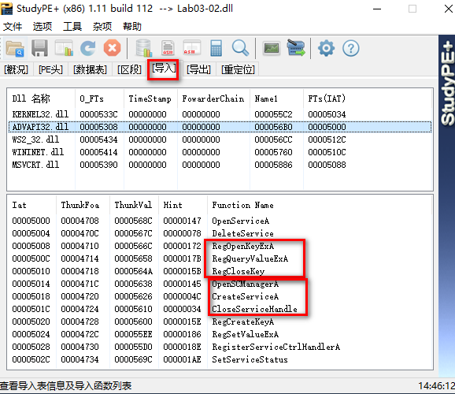 

继续看，该dll还具有操作http相关的功能。

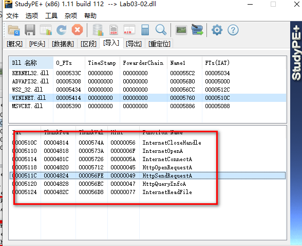 

在其字符串中有出现网址，并且有出现`svchost`,这是Windows的一个宿主程序，有许多的系统dll都附着在该程序中运行，所以本次使用目的有可能也是需要通过附着到svchost上到达代码运行的效果。

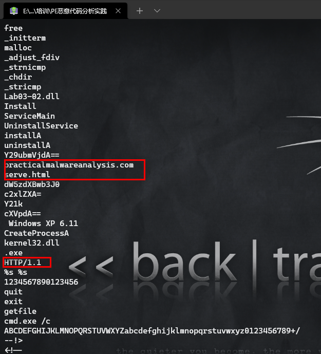 

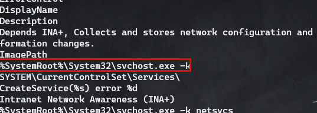 

#### 让恶意代码自行安装

在静态分析中，我们得到了导出函数中有一个`installA`函数，所以我们这里大胆猜测是用这个函数进行dll的安装。

那么在Windows系统中有这么一个程序`rundll32.exe`， 专门用来安装dll程序的。

```bash
#命令行
rundll32.exe Lab03-02.dll,installA
```

这里先不急着运行，因为我们运行后也看不到任何结果，而我们这里主要关注下其文件对注册表进行了哪些修改，所以我们需要用到`Regshot`工具。

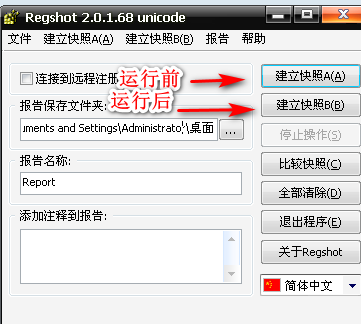 

恶意程序添加了一个名为`IPRIP`的服务，并且服务显示名与描述信息如第二处标红位置。

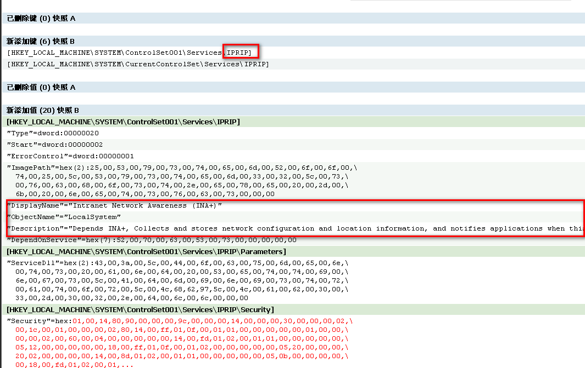 


### 题目2：运行恶意代码
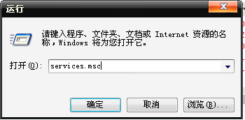 

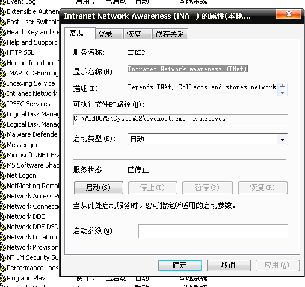 

然后你可以点击上面的启动来运行dll，当然也可以用如下的命令进行服务的启动。

```bash
#命令行
net start IPRIP
```

### 题目3：找到恶意代码附着的进程

在`Process Explorer`中点击Find菜单，并且输入需要查找的dll回车后即可得到dll附加进程的信息。

 

### 题目4：Process Monitor设置过滤dll监控

因为dll是需要exe加载运行，所以我们设置Process Name为dll名字是无效的,而我们这里的Process Name是`svchost.exe`，但是系统中有很多的svchost.exe导致我们不好定位，这里解决的办法是得到进程的pid如上图`1108`

`我们先运行Process Monitor然后再启动服务，最后在进行如下数据的过滤。`

 

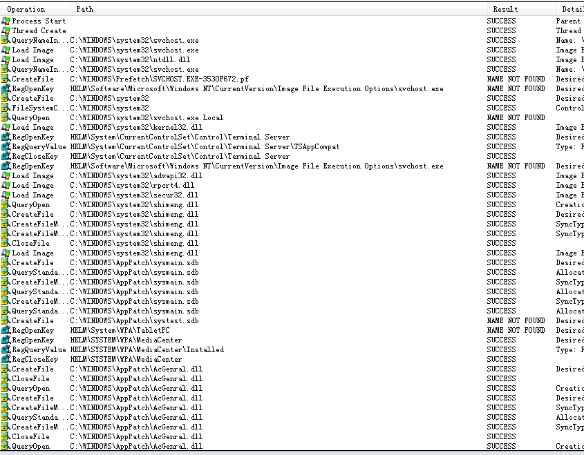 

### 题目5：感染迹象特征

程序会附着在系统进程`svchost.exe`中

### 题目6：网络特征

解析域名，访问http

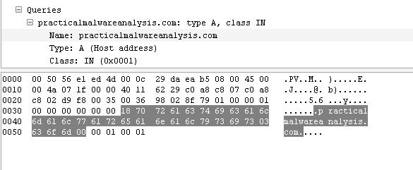 
 

### 实验二总结：

通过实验二，我们知道了用rundll32.exe来安装dll，知道了`svchost.exe`可以让dll附着并运行服务，还知道了Process Monitor可以用过用pid的方式来过滤我们想要的dll监控数据。


## 总结：

在动态分析基础技术中的实验，我们学习到了如下技能

- Process Monitor可以用来监控程序的行为
- Process Explorer可以用来查看进程的信息
- WireShark可以抓到应用程序的网络流量包
- Regshot可以对比程序运行前后的注册表值
- rundll32.exe 可以用来安装dll
- svchost.exe 即服务可以用来运行dll，或附着dll。


